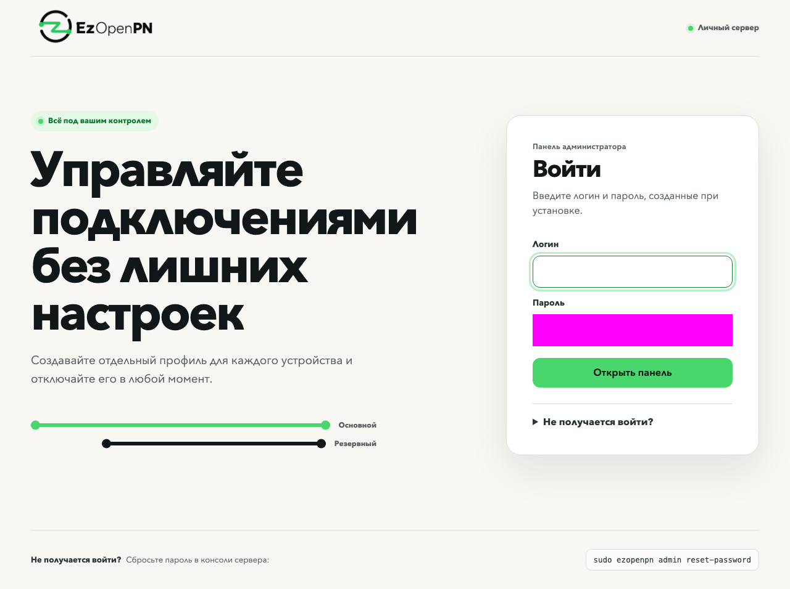

# Установка с нуля

Первая рекомендация: используйте отдельный чистый VPS без сайтов, панелей хостинга и других сервисов. VPS является небольшим компьютером в дата-центре, который работает круглосуточно. Вы арендуете его, а EzOpenPN устанавливает личную панель и создаёт настройки для ваших устройств. Программировать и покупать домен не нужно. Эта инструкция относится к предварительному выпуску v0.1.9.

## 1. Выберите отдельный чистый сервер

Для первой установки арендуйте отдельный чистый VPS. Не ставьте EzOpenPN рядом с сайтом, панелью хостинга, рабочей базой или чужими контейнерами.

В карточке сервера выберите:

- Ubuntu 24.04 LTS как основной вариант для нового сервера;
- архитектуру amd64 или x86_64;
- тариф от 1 ГиБ RAM; установщику достаточно 512 МиБ общей памяти, видимой ОС после резервирования ядром, swap не обязателен;
- не менее 4 ГиБ свободного диска;
- напрямую назначенный публичный IPv4;
- вход по SSH с root или пользователем с `sudo`.

Также поддерживаются Ubuntu 22.04 LTS, Debian 12 и Debian 13. Сервер за NAT, система с общим адресом или ARM для первой версии не подходят.

До оплаты проверьте лимит трафика, правила использования сервера, стоимость продления и порядок отмены. Конкретный провайдер не требуется. Местоположение и сеть дата-центра влияют на доступность; универсально работающей страны или тарифа нет.

Сохраните в менеджере паролей адрес сервера, имя пользователя (часто `root`) и выданный пароль. Включите двухфакторную защиту кабинета провайдера. Найдите кнопку Console, VNC или Rescue: через аварийную консоль можно восстановить вход, даже если SSH недоступен.

Если при создании VPS предлагается поле SSH key, можно сразу добавить туда **открытую** часть ключа по [инструкции](ssh-security.md#1-создайте-ключ-на-своём-компьютере). Закрытый ключ никуда не загружайте.

## 2. Откройте правила у провайдера

В панели провайдера найдите раздел Firewall, Security group или Сетевые правила. Порт похож на отдельную дверь для конкретной службы. Если входящий firewall включён, разрешите:

| Порт | Протокол | Для чего |
|---|---|---|
| 22, если провайдер не выдал другой | TCP | SSH, управление сервером |
| 80 | TCP | Получение и продление сертификата |
| 443 | TCP | Транспорт A |
| 443 | UDP | Транспорт B |
| 9443 | TCP | Веб-панель и общие ссылки |

Для четырёх портов EzOpenPN нужен доступ из интернета. В поле источника обычно выбирают Anywhere или `0.0.0.0/0` (любой IPv4). Если провайдер не применяет firewall, отдельно создавать его для установки не требуется.

Не удаляйте действующее правило SSH и не нажимайте «запретить всё». Не закрывайте порт 80 после установки: он нужен для продления сертификата. Ограничение 9443 одним домашним адресом закроет и обновление профилей из мобильной сети. Сам установщик не управляет кабинетом провайдера.

## 3. Подключитесь по SSH

На **своём компьютере** откройте «Терминал» на Mac, PowerShell в Windows или терминал в Linux. Вставьте команду:

```bash
ssh root@SERVER_IP
```

Замените `SERVER_IP` адресом из кабинета, без скобок и пробелов. Если выдано другое имя пользователя, замените `root` на него. Если выдан другой порт, используйте `ssh -p НОМЕР_ПОРТА root@SERVER_IP`.

Если при создании VPS вы уже добавили ключ `ezopenpn_ed25519` из нашей инструкции, **вместо обычного входа** укажите его явно. На Mac/Linux:

```bash
ssh -o IdentitiesOnly=yes -i "$HOME/.ssh/ezopenpn_ed25519" root@SERVER_IP
```

В Windows PowerShell:

```powershell
ssh -o IdentitiesOnly=yes -i "$env:USERPROFILE/.ssh/ezopenpn_ed25519" root@SERVER_IP
```

Без `-i` SSH может не найти ключ с нестандартным именем. При другом имени файла подставьте своё.

При первом входе SSH показывает отпечаток сервера и спрашивает, доверяете ли вы ему. Сверьте отпечаток с кабинетом или аварийной консолью провайдера; [как это сделать](ssh-security.md#если-ssh-пишет-что-ключ-сервера-изменился). Только при совпадении введите `yes`. Затем введите пароль сервера, если ключ ещё не настроен. Символы и звёздочки не отображаются, это нормально.

После входа приглашение будет похоже на `root@server:~#`. **Теперь команды выполняются на сервере**, а не на вашем компьютере. Если вошли не как `root`, выполните `sudo -i` и введите пароль этого пользователя. Если прав нет, запросите административный доступ у провайдера.

До установки настройте [вход по ключу и отключение паролей](ssh-security.md). Инструкция отдельно отмечает команды для компьютера и сервера. Не закрывайте первоначальное SSH-окно, пока не проверите новый вход.

## 4. Установите EzOpenPN

В SSH-окне сервера под `root` вставьте всю строку:

```bash
curl -fsSL https://git.alexzabrodin.pro/ezopenpn/releases/download/v0.1.9/install.sh | env EZOPENPN_EXPECTED_VERSION=v0.1.9 EZOPENPN_RELEASE_BASE_URL=https://git.alexzabrodin.pro/ezopenpn/releases/download/v0.1.9 bash
```

Это одна команда. Она скачивает подписанный пакет v0.1.9, проверяет его и запускает установку. Визуальный перенос длинной строки не мешает копированию. Не заменяйте версию или адрес на `latest`: пока там старый стабильный канал.

Если минимальный образ сообщает `curl: command not found` или `python3: command not found`, выполните под `root` подготовку и повторите установку:

```bash
apt-get update && apt-get install -y ca-certificates curl python3
```

Сценарий проверяет систему, публичный адрес, свободные порты, память, диск, время, исходящий HTTPS, Docker и firewall. При необходимости устанавливает Docker и Compose, скачивает пять сервисов и получает сертификат. Скачивание может занять несколько минут. Если проверка нашла конфликт, исправьте указанную причину и повторите команду.

Когда появится запрос:

1. Введите логин администратора длиной от 1 до 64 символов.
2. Придумайте пароль длиной не менее 12 символов, не совпадающий с логином.
3. Повторите пароль. Символы пароля в терминале не показываются.

Это **не пароль сервера** и не пароль кабинета провайдера. Сохраните его в менеджере паролей. Не закрывайте SSH до сообщения `EzOpenPN готов.`.

## 5. Проверьте результат

Установщик покажет адрес `https://SERVER_IP:9443`. Откройте **адрес из своего терминала** в браузере, включая `https://` и `:9443`. Войдите с созданными данными. Если сообщение об ошибке было раньше и строки `EzOpenPN готов.` нет, установка ещё не завершилась.

Браузер должен доверять сертификату без исключений. При предупреждении «Соединение не защищено» не вводите пароль и не отключайте проверку сертификата; см. [диагностику](troubleshooting.md).



На снимке поле с данными администратора намеренно закрыто. Настоящий пароль нигде в документации не сохраняется.

В консоли можно дополнительно выполнить:

```bash
sudo ezopenpn status
```

Нормальный итог содержит пять сервисов со статусом `healthy`, срок сертификата, число активных профилей и строку `Итог: готово`.

Если вы работаете под `root`, а `sudo` отсутствует, пишите `ezopenpn status` без `sudo`. Это относится ко всем командам обслуживания в документации. До создания первого профиля число `Активных профилей: 0` нормально. `status` проверяет сервер, но не доказывает, что ваш оператор пропускает оба транспорта.

## 6. Добавьте телефон или компьютер

1. В панели создайте профиль с именем устройства, например `Мой телефон`.
2. На этом устройстве установите клиентское приложение из [официальных источников](compatibility.md). Полная матрица совместимости предварительного выпуска ещё собирается.
3. Скопируйте общую ссылку из карточки профиля. В приложении найдите добавление профиля или подписки из буфера обмена. Если панель открыта на другом устройстве, можно сканировать QR-код. Не отправляйте ссылку в публичный чат.
4. Выберите основной вариант A и включите подключение. Названия кнопок зависят от приложения. Если операционная система запросит разрешение создать сетевое подключение, проверьте название приложения и разрешите его.
5. Откройте несколько обычных сайтов, проверьте загрузку страницы или файла. Затем отдельно выберите вариант B и повторите проверку. Wi-Fi и мобильную сеть проверяйте отдельно: в одной из них может работать только один вариант.

Для следующего устройства создайте новый профиль. Не раздавайте пароль администратора: устройству нужна только его ссылка. [Подробности импорта и отключения](profiles.md).

После проверки SSH-окно можно закрыть командой `exit`. Сервер продолжит работать без включённого домашнего компьютера.

## 7. Сохраните памятку

| Ситуация | Что сделать на сервере по SSH |
|---|---|
| Посмотреть состояние | `sudo ezopenpn status` |
| Проверить причину ошибки | `sudo ezopenpn doctor` |
| Забыт пароль панели | `sudo ezopenpn admin reset-password` |
| Сохранить резервную копию | `sudo ezopenpn backup` |

Сброс пароля панели сохраняет профили, но закрывает прежние сеансы администратора. Если потерян SSH-ключ, сначала восстановите вход через кабинет провайдера: команда сброса панели его не заменяет.

Резервная копия на самом VPS исчезнет при удалении VPS. Как забрать её на компьютер и безопасно хранить, описано в [обслуживании](recovery.md). Если доступ перестал работать, пройдите [проверки до смены сервера](server-migration.md).

## Что установщик меняет

- При необходимости ставит Docker Engine и Compose из официального репозитория.
- Создаёт каталоги проекта `/etc/ezopenpn`, `/var/lib/ezopenpn` и `/var/backups/ezopenpn`.
- Добавляет только четыре нужных правила в активный UFW или firewalld.
- Устанавливает службу systemd и команду `/usr/local/bin/ezopenpn`.
- Не меняет SSH, пользователей сервера и произвольные правила firewall.

Если шаг завершился ошибкой, найдите код в [справочнике диагностики](troubleshooting.md).
