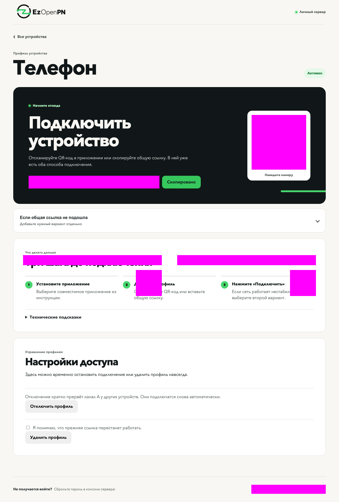

# Профили подключения

Профиль содержит общую ссылку и два независимых транспорта. Рекомендуется создавать отдельный профиль для каждого телефона, компьютера или планшета. Тогда потерянное устройство можно отключить, не меняя остальные.

## Добавление за три шага

1. <!-- data-profile-step --> **Создайте профиль.** В панели укажите понятное имя, например `Телефон`.
2. <!-- data-profile-step --> **Установите приложение.** Выберите приложение и версию из [проверенного списка](compatibility.md).
3. <!-- data-profile-step --> **Добавьте профиль и подключитесь.** Отсканируйте QR-код или вставьте общую ссылку. Она добавляет оба варианта сразу, чтобы при нестабильной работе можно было переключиться на второй.

Ссылки и QR-коды на снимке намеренно закрыты. В своей панели вы увидите их только после входа.

После импорта включите созданный профиль в приложении и откройте любой нейтральный сайт для проверки. Не публикуйте ссылку и QR-код: тот, кто их получил, сможет использовать ваш сервер.

Технические сведения

Транспорт A использует VLESS + Reality поверх XHTTP с режимом `packet-up`. Транспорт B использует Hysteria2 с Salamander. Если приложение предлагает обычный multiplexing для транспорта B, отключите его. Общая HTTPS ссылка возвращает обе отдельные ссылки в формате подписки.

## Состояния

- `Активен`: обе ссылки разрешены.
- `Отключён`: новые подключения запрещены, активные сеансы отозваны.
- `Нужна проверка`: подготовка не завершилась. Нажмите повтор подготовки или запустите `sudo ezopenpn doctor`.

## Отключение и включение

Откройте карточку и нажмите `Отключить профиль`. Транспорт A кратко перезапускается, поэтому другие устройства могут переподключиться. Транспорт B отзывается отдельно. После завершения обе старые ссылки этого профиля должны перестать работать.

Кнопка `Включить профиль` возвращает доступ с прежними ссылками. Удаление сначала отзывает доступ, затем уничтожает секретный материал. После удаления прежние ссылки восстановить нельзя.

## Если общая ссылка не импортируется

1. Обновите приложение до версии, указанной в [таблице совместимости](compatibility.md).
2. Попробуйте отсканировать QR-код вместо вставки.
3. Импортируйте отдельный транспорт A.
4. Импортируйте отдельный транспорт B.
5. Если один транспорт работает, а второй нет, проверьте `443/tcp` и `443/udp` в облачном firewall.

Ссылки не нужно присылать в issue или вставлять в команду диагностики. Команда `sudo ezopenpn logs` скрывает известные секреты, но её вывод всё равно следует просмотреть перед отправкой.
